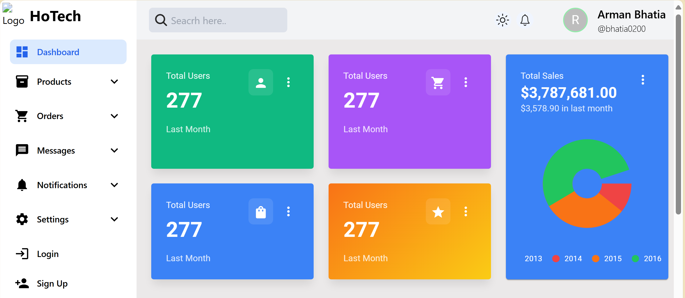
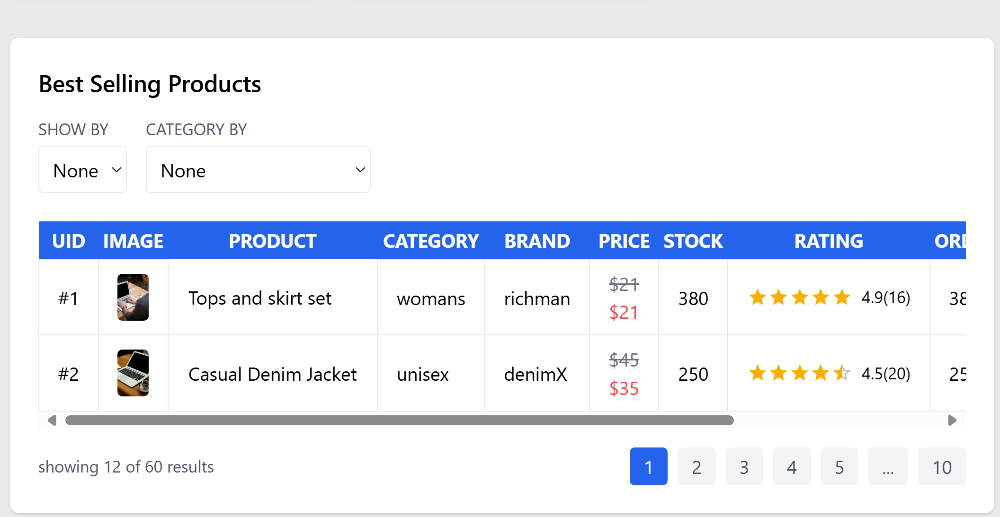

# 🚀 Project Dashboard

Welcome to the **Project Dashboard** repository! This application allows users to seamlessly **add, view, and delete products**, providing a clean and intuitive interface for managing product inventories. Whether you're a developer looking to explore the codebase or a user managing products, this project is designed to enhance your workflow efficiently.

 

 


## 🌟 Technologies Used

- 🎨 **HTML** – The foundational structure of the web application.
- 💅 **CSS** – Ensuring a visually appealing and responsive UI.
- ⚡ **JavaScript (ES6)** – Adding interactivity and dynamic functionality.
- ⚛️ **React** – A powerful library for building smooth user interfaces.
- 🔀 **React Router** – Enabling seamless navigation between different views.
- 🎨 **Tailwind CSS** – Utility-first CSS framework for crafting modern UI.
- 🖌 **Material-UI** – Pre-designed components for a polished and professional look.
- 🗄️ **Node.js & Express** – Backend support for handling CRUD operations.
- 🛢️ **MongoDB** – Storing product data efficiently.

## 🔥 Features

### 🛍️ Product Management
- **Add New Products** – Enter product details and add them to the dashboard.
- **View Products** – Browse a list of all available products with detailed descriptions.
- **Delete Products** – Remove products seamlessly with a single click.

### 📱 Responsive UI
- Optimized for both **desktop and mobile devices** using Tailwind CSS.
- Clean, minimal, and easy-to-use user interface.

### 🔗 Routing & Navigation
- Smooth navigation between different views using **React Router**.
- Organized components ensuring a structured user experience.

### ⚡ Performance Optimization
- Utilized **React best practices** for fast rendering and state management.
- **Lazy loading & code splitting** for enhanced app performance.

### 🔐 Secure & Scalable
- Implemented **backend validation** to prevent incorrect product data entries.
- Secure **API endpoints** with authentication for user access.

## 📖 How to Get Started

1️⃣ **Clone the Repository**
```bash
git clone https://github.com/your-username/project-dashboard.git
cd project-dashboard
```

2️⃣ **Install Dependencies**
```bash
npm install
```

3️⃣ **Run the Application Locally**
```bash
npm start
```

4️⃣ **Start the Backend** (if applicable)
```bash
cd backend
npm install
npm start
```

🚀 **Explore the codebase, contribute, or use this as inspiration for your own projects. If you have any feedback, feel free to reach out!**

Happy Coding! 🎉

